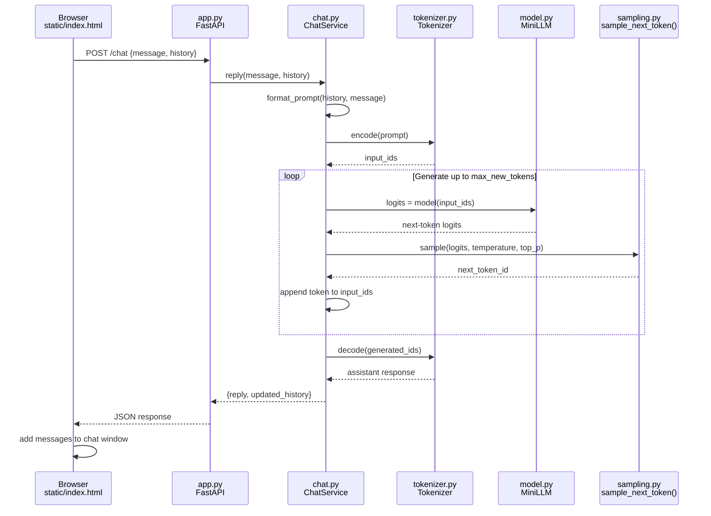

# practice-llm

`practice-llm` is a learning-focused Python project that builds a small
decoder-only language model from scratch and exposes it through a FastAPI chat
application. The implementation prioritizes readable components and
reproducible experiments over production-scale performance.

## Current status

The project foundation is in place: packaging, automated quality checks, Codex
collaboration guidance, and a small FastAPI health endpoint. Model training,
generation, and the chat UI will be added in the tracked GitHub issues.

## Setup

Use Python 3.11 or newer. Create an isolated virtual environment and install
the project with its development tools:

```bash
python -m venv .venv
source .venv/bin/activate
python -m pip install -e ".[dev]"
```

## Run the API

```bash
python -m uvicorn practice_llm.api.main:app --reload
```

Open <http://127.0.0.1:8000/health> to confirm the server is ready.

## Target chat request flow

The components below will be added in the model, training, API, and web UI
issues. This is the intended end-to-end boundary for a browser chat request.



## Quality checks

```bash
python -m ruff check .
python -m mypy src
python -m pytest
```

## Data plan

The first training corpus will be Tiny Shakespeare, a small public text corpus
that supports fast iteration. Corpus downloads, deterministic train-validation
splitting, provenance, and checksums will be implemented in the data issue;
generated data and checkpoints are intentionally ignored by Git.

## AI collaboration

Read [`AGENTS.md`](AGENTS.md) (Codex) or [`CLAUDE.md`](CLAUDE.md) (Claude
Code) before contributing; both describe the same project rules for their
respective tools. Repository-specific Codex skills live in
[`.agents/skills`](.agents/skills): `python-quality` applies the quality
workflow, and `llm-experiment` records reproducibility requirements. The
Claude Code equivalents live in [`.claude/rules`](.claude/rules), and
[`.claude/agents/architecture-reviewer.md`](.claude/agents/architecture-reviewer.md)
is a subagent for reviewing changes against the architecture boundaries.
